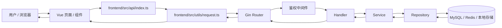
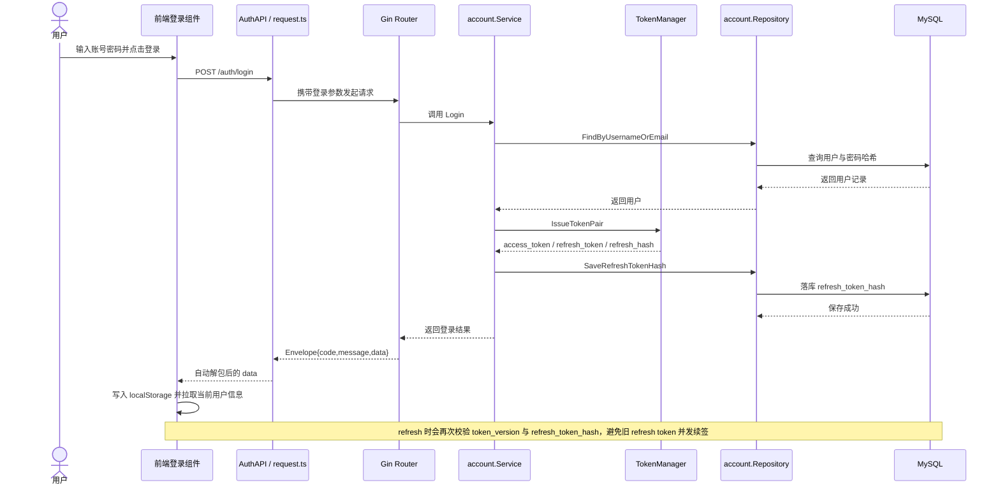
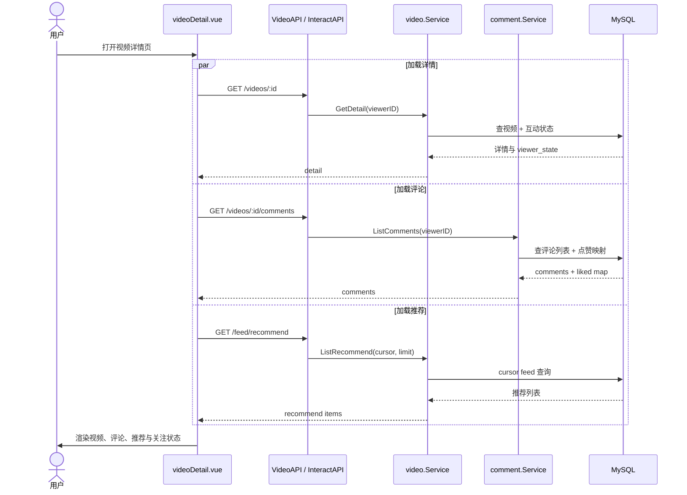
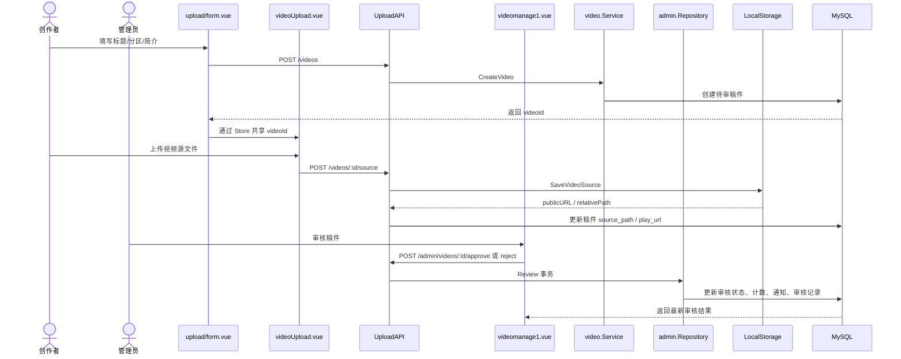

# PILIPILI Go 关键代码实现说明

这份文档面向代码走读、项目复盘和面试准备，专门整理 **PILIPILI Go** 前后端最值得看的关键实现。

目标不是把所有文件都列一遍，而是回答下面几个最重要的问题：

- 后端是从哪里启动的，生命周期怎么管理
- 请求是如何经过路由、中间件、Handler、Service、Repository 落到数据库的
- 登录态、Token 刷新、用户上下文是如何串起来的
- 视频详情、评论、点赞、收藏、关注、上传、审核这些主链路是怎么实现的
- 前端是如何统一发请求、处理登录态、消费后端返回结构的
- 哪些代码是最适合在面试里重点讲的

> 阅读提示
>
> - 本文中的链接都以 `docs/` 目录为基准，因此后端文件使用 `../backend/...`，前端文件使用 `../frontend/...`
> - 如果你的 Markdown 预览器不支持 `#Lxx` 行号锚点，可以先打开文件，再按本文标注的行号定位
> - 推荐先按“后端主链路”阅读，再看“前端主链路”，最后看“前后端接口契约”

---

## 零、Mermaid 图示速览

这一节先用图把主链路串起来。建议先看图，再对照下面的源码入口阅读。

### 1. 通用请求流图

### 2. 登录与会话刷新时序图

### 3. 视频详情页请求时序图

### 4. 投稿与审核流时序图

### 5. 图示与源码对应索引

如果你准备顺着图来走读源码，可以按下面这条路径直接跳：

- 通用请求流图
  - [../frontend/src/utils/request.ts#L4](../frontend/src/utils/request.ts#L4)：前端统一请求封装、Token 注入、响应解包
  - [../backend/internal/http/router.go#L30](../backend/internal/http/router.go#L30)：路由装配、健康检查、中间件分层
  - [../backend/internal/video/service.go#L55](../backend/internal/video/service.go#L55)：Service 层如何承接 Handler 的业务编排
  - [../backend/internal/video/repo.go#L87](../backend/internal/video/repo.go#L87)：Repository 层如何把查询真正落到数据库
- 登录与会话刷新时序图
  - [../frontend/src/components/header/login.vue#L161](../frontend/src/components/header/login.vue#L161)：登录表单提交与本地登录态写入
  - [../backend/internal/account/service.go#L121](../backend/internal/account/service.go#L121)：登录校验、签发 Token、保存 refresh hash
  - [../backend/internal/account/service.go#L154](../backend/internal/account/service.go#L154)：refresh token 刷新与并发续签保护
  - [../backend/internal/auth/token.go#L47](../backend/internal/auth/token.go#L47)：双 Token 签发与 Claims 设计
- 视频详情页请求时序图
  - [../frontend/src/components/detail/videoDetail.vue#L151](../frontend/src/components/detail/videoDetail.vue#L151)：详情页同时拉详情、评论、推荐、关注状态
  - [../frontend/src/components/video/videoMore.vue#L30](../frontend/src/components/video/videoMore.vue#L30)：播放区点赞/收藏/历史上报
  - [../backend/internal/video/service.go#L165](../backend/internal/video/service.go#L165)：详情接口补齐 viewer_state
  - [../backend/internal/comment/repo.go#L90](../backend/internal/comment/repo.go#L90)：评论列表与回复树查询
  - [../backend/internal/history/repo.go#L44](../backend/internal/history/repo.go#L44)：观看历史上报的 upsert 实现
  - [../backend/internal/social/repo.go#L32](../backend/internal/social/repo.go#L32)：关注关系与 viewer_state.followed 底层查询
- 投稿与审核流时序图
  - [../frontend/src/views/upload/form.vue#L69](../frontend/src/views/upload/form.vue#L69)：先建稿件元数据
  - [../frontend/src/components/upload/videoUpload.vue#L27](../frontend/src/components/upload/videoUpload.vue#L27)：再上传大文件并回填播放地址
  - [../frontend/src/views/management/videomanage1.vue#L64](../frontend/src/views/management/videomanage1.vue#L64)：后台待审列表与通过/驳回操作
  - [../backend/internal/video/service.go#L293](../backend/internal/video/service.go#L293)：创建稿件与编辑稿件的状态流转
  - [../backend/internal/admin/repo.go#L95](../backend/internal/admin/repo.go#L95)：审核事务一次更新状态、计数、通知、审计记录

## 面试配套

- 项目讲解顺序：[INTERVIEW_TALK_TRACK.md](./INTERVIEW_TALK_TRACK.md)
- 简历项目描述与标准回答：[RESUME_PROJECT_WRITEUP_AND_QA.md](./RESUME_PROJECT_WRITEUP_AND_QA.md)

## 一、最值得优先看的文件

如果你时间有限，建议优先看下面这些文件：

### 后端必读

1. [../backend/cmd/api/main.go#L27](../backend/cmd/api/main.go#L27)
2. [../backend/internal/http/router.go#L30](../backend/internal/http/router.go#L30)
3. [../backend/internal/middleware/auth/auth.go#L14](../backend/internal/middleware/auth/auth.go#L14)
4. [../backend/internal/auth/token.go#L47](../backend/internal/auth/token.go#L47)
5. [../backend/internal/account/service.go#L121](../backend/internal/account/service.go#L121)
6. [../backend/internal/video/service.go#L60](../backend/internal/video/service.go#L60)
7. [../backend/internal/video/repo.go#L87](../backend/internal/video/repo.go#L87)
8. [../backend/internal/comment/repo.go#L90](../backend/internal/comment/repo.go#L90)
9. [../backend/internal/admin/repo.go#L95](../backend/internal/admin/repo.go#L95)
10. [../backend/internal/media/storage.go#L36](../backend/internal/media/storage.go#L36)

### 前端必读

1. [../frontend/src/utils/request.ts#L4](../frontend/src/utils/request.ts#L4)
2. [../frontend/src/api/index.ts#L6](../frontend/src/api/index.ts#L6)
3. [../frontend/src/components/header/login.vue#L161](../frontend/src/components/header/login.vue#L161)
4. [../frontend/src/components/detail/videoDetail.vue#L151](../frontend/src/components/detail/videoDetail.vue#L151)
5. [../frontend/src/components/detail/floor.vue#L123](../frontend/src/components/detail/floor.vue#L123)
6. [../frontend/src/components/video/videoMore.vue#L59](../frontend/src/components/video/videoMore.vue#L59)
7. [../frontend/src/views/upload/form.vue#L69](../frontend/src/views/upload/form.vue#L69)
8. [../frontend/src/components/upload/videoUpload.vue#L27](../frontend/src/components/upload/videoUpload.vue#L27)
9. [../frontend/src/views/management/videomanage1.vue#L64](../frontend/src/views/management/videomanage1.vue#L64)

---

## 二、后端主链路 (Backend)

后端整体是典型的分层结构：

`main -> router -> middleware -> handler -> service -> repository -> db`

### 1. 程序入口与生命周期管理

关键文件：

- [../backend/cmd/api/main.go#L27](../backend/cmd/api/main.go#L27)
- [../backend/internal/config/config.go#L58](../backend/internal/config/config.go#L58)
- [../backend/internal/db/db.go#L14](../backend/internal/db/db.go#L14)
- [../backend/internal/redis/redis.go#L17](../backend/internal/redis/redis.go#L17)

关键逻辑：

- `main` 函数负责加载配置、初始化 MySQL、初始化 Redis、做各模块 `AutoMigrate`、写入默认分区数据、启动 Gin 路由，并最终挂到 `http.Server`
- 配置读取不是“读完就用”，而是先 `applyDefaults` 再 `validate`，会强制校验数据库 DSN、Redis 地址和 JWT 密钥，避免拿占位值启动服务
- MySQL 与 Redis 初始化完成后都会立刻 `Ping`，把依赖问题尽早暴露在启动阶段，而不是在第一条请求到来时才报错
- 服务退出时使用 `signal.NotifyContext` + `server.Shutdown` 做优雅停机，保证正在处理中的请求有时间收尾

面试可讲点：

- 为什么要在启动阶段做配置强校验，而不是运行时报错
- 为什么 API 服务要做优雅停机，而不能只靠 `Ctrl+C`
- 为什么 `AutoMigrate` 和 `SeedDefaults` 放在启动链路里是合理的

### 2. 路由装配与中间件分层

关键文件：

- [../backend/internal/http/router.go#L30](../backend/internal/http/router.go#L30)
- [../backend/internal/middleware/auth/auth.go#L14](../backend/internal/middleware/auth/auth.go#L14)
- [../backend/internal/middleware/auth/optional.go#L13](../backend/internal/middleware/auth/optional.go#L13)
- [../backend/pkg/response/response.go#L15](../backend/pkg/response/response.go#L15)

关键逻辑：

- `NewRouter` 里统一创建所有业务模块的 Handler，然后注册到 `/api/v1` 下
- 路由分成三类：
  - 无需鉴权，比如 `feed/recommend`、`areas`、`videos/:id`
  - 软鉴权，比如视频详情和评论列表，即游客可看、登录用户能看到更多 `viewer_state`
  - 强鉴权，比如点赞、收藏、评论、投稿、后台审核
- `/healthz` 不只是返回固定字符串，而是实际探测 MySQL 和 Redis 状态，属于真实健康检查
- 后端响应统一走 `pkg/response` 的 `Envelope{code,message,data}` 包裹结构，前端会在 `request.ts` 里统一解包

为什么重要：

- 这部分决定了整个项目的请求入口是否统一
- 软鉴权和强鉴权的区分，是视频平台这类业务里非常典型也非常常见的设计点

### 3. JWT 登录态、双 Token 和无感刷新

关键文件：

- [../backend/internal/auth/token.go#L47](../backend/internal/auth/token.go#L47)
- [../backend/internal/account/service.go#L121](../backend/internal/account/service.go#L121)
- [../backend/internal/account/service.go#L154](../backend/internal/account/service.go#L154)
- [../backend/internal/account/repo.go#L110](../backend/internal/account/repo.go#L110)
- [../backend/internal/account/repo.go#L129](../backend/internal/account/repo.go#L129)
- [../backend/internal/middleware/auth/auth.go#L14](../backend/internal/middleware/auth/auth.go#L14)
- [../backend/pkg/authctx/context.go#L23](../backend/pkg/authctx/context.go#L23)

关键逻辑：

- `TokenManager.IssueTokenPair` 会一次性签发 `access token` 和 `refresh token`
- Token payload 里不只包含 `user_id`，还包含 `token_version`、`token_type`，`refresh token` 额外带 `refresh_id`
- `refresh_id` 不直接明文落库，而是通过 `HashRefreshID` 做哈希后保存，避免数据库泄露时直接复用 refresh token 标识
- 登录成功后，`account.Service.Login` 会把新的 `refresh_token_hash` 写回用户表
- 刷新流程里，`account.Service.Refresh` 会校验三件事：
  - refresh token 本身是否合法
  - 用户当前 `token_version` 是否匹配
  - 当前 token 的 `refresh_id` 哈希是否与数据库一致
- `RotateRefreshTokenHash` 使用 `WHERE id + token_version + refresh_token_hash` 的条件更新，等价于做了一次简化的 CAS，避免并发 refresh 把旧 token 再次续活
- 退出登录时，`InvalidateTokens` 会清空 `refresh_token_hash` 并把 `token_version + 1`，实现 access token 的统一失效
- 鉴权中间件校验通过后，会把用户基本信息写入 Gin Context 和 `request.Context`，后续 service 可以直接通过 `authctx.CurrentUser` 取到当前用户

这一段是整个项目里最值得讲的实现之一，因为它体现了：

- 会话设计
- Token 失效模型
- 并发刷新下的安全性
- 中间件向业务层透传用户上下文

### 4. 统一分页与统一响应契约

关键文件：

- [../backend/pkg/request/pagination.go#L14](../backend/pkg/request/pagination.go#L14)
- [../backend/pkg/response/response.go#L9](../backend/pkg/response/response.go#L9)
- [../frontend/src/utils/request.ts#L29](../frontend/src/utils/request.ts#L29)

关键逻辑：

- `ParsePagination` 统一解析 `page/page_size`，避免每个 Handler 各写一套参数解析逻辑
- 后端统一返回 `Envelope{code,message,data}`
- 前端 `request.ts` 的响应拦截器统一把包裹层拆开，直接返回真实的 `data`
- 因为有了这个契约，前端业务层可以直接写 `const data = await VideoAPI.getVideoDetail(...)`，而不是到处写 `res.data.data`

这是一条很适合在面试里讲的“前后端接口契约”链路。

### 5. 视频主链路：推荐流、热门流、详情页

关键文件：

- [../backend/internal/video/handler.go#L23](../backend/internal/video/handler.go#L23)
- [../backend/internal/video/service.go#L60](../backend/internal/video/service.go#L60)
- [../backend/internal/video/service.go#L163](../backend/internal/video/service.go#L163)
- [../backend/internal/video/repo.go#L87](../backend/internal/video/repo.go#L87)
- [../backend/internal/video/repo.go#L114](../backend/internal/video/repo.go#L114)
- [../backend/internal/video/repo.go#L143](../backend/internal/video/repo.go#L143)
- [../backend/internal/video/repo.go#L508](../backend/internal/video/repo.go#L508)
- [../backend/internal/video/entity.go#L16](../backend/internal/video/entity.go#L16)

关键逻辑：

- 视频表 `Video` 同时保存了内容属性和聚合计数，例如 `like_count`、`favorite_count`、`comment_count`、`view_count`、`hot_score`
- 推荐流、热门流、关注流都不是传统 `page + page_size`，而是走 `cursor` 模式，避免深分页性能问题，也更适合 feed 场景
- 推荐流的排序锚点是 `published_at + id`
- 热门流的排序锚点是 `hot_score + published_at + id`
- `publicVideoBase` 统一收口了公开视频筛选条件：
  - `videos.status = visible`
  - `review_status = approved`
  - `published_at IS NOT NULL`
  - 作者状态必须为 active
- 视频详情 `GetDetail` 会根据 `viewerID` 补齐 `viewer_state`，把“当前用户是否已点赞/已收藏/已关注作者”一起返回给前端

为什么这部分关键：

- feed 查询和详情页通常是视频平台访问最重的接口
- 用 `publicVideoBase` 把筛选条件统一收口，是非常典型的 Repository 抽象能力
- `viewer_state` 的设计让前端不必额外请求多次状态接口

### 6. 点赞、收藏与计数一致性

关键文件：

- [../backend/internal/video/repo.go#L418](../backend/internal/video/repo.go#L418)
- [../backend/internal/video/repo.go#L461](../backend/internal/video/repo.go#L461)
- [../backend/internal/video/repo.go#L592](../backend/internal/video/repo.go#L592)

关键逻辑：

- 视频点赞和收藏都包在事务里
- 插入点赞/收藏关系时使用 `OnConflict DoNothing`，保证幂等
- 只有当关系表真正新增成功时，才去增加视频的 `like_count` / `favorite_count`
- 取消点赞/取消收藏时，会先删关系，再做防负数递减
- 这种写法避免了重复点击导致计数和关系不一致

这是“关系表 + 聚合计数冗余”这一类业务最典型的实现方式。

### 7. 评论树与回复链路

关键文件：

- [../backend/internal/comment/entity.go#L11](../backend/internal/comment/entity.go#L11)
- [../backend/internal/comment/service.go#L30](../backend/internal/comment/service.go#L30)
- [../backend/internal/comment/repo.go#L40](../backend/internal/comment/repo.go#L40)
- [../backend/internal/comment/repo.go#L90](../backend/internal/comment/repo.go#L90)
- [../backend/internal/comment/repo.go#L122](../backend/internal/comment/repo.go#L122)
- [../backend/internal/comment/repo.go#L224](../backend/internal/comment/repo.go#L224)
- [../backend/internal/comment/repo.go#L268](../backend/internal/comment/repo.go#L268)

关键逻辑：

- 评论模型使用 `root_id + parent_id` 表达树结构：
  - 一级评论：`root_id = 0, parent_id = 0`
  - 二级回复：`root_id = 一级评论 ID, parent_id = 直接回复对象 ID`
- 创建一级评论时，会插入评论并同步增加视频的 `comment_count`
- 创建回复时，会：
  - 找到父评论
  - 计算真正的 `root_id`
  - 新建回复
  - 给根评论增加 `reply_count`
  - 给视频增加 `comment_count`
- 评论/回复列表不是“先查评论，再循环查用户”，而是用 `JOIN users` 一次查出展示所需字段
- `LikeMap` 会批量查当前用户对评论列表的点赞关系，再在 service 层合成 `viewer_state.liked`，避免 N+1 查询

这部分特别适合讲“评论树怎么建模”和“如何避免 N+1 查询”。

### 8. 关注关系与 `viewer_state.followed`

关键文件：

- [../backend/internal/social/service.go#L27](../backend/internal/social/service.go#L27)
- [../backend/internal/history/service.go#L26](../backend/internal/history/service.go#L26)
- [../backend/internal/social/repo.go#L32](../backend/internal/social/repo.go#L32)
- [../backend/internal/social/repo.go#L83](../backend/internal/social/repo.go#L83)
- [../backend/internal/account/service.go#L205](../backend/internal/account/service.go#L205)
- [../backend/internal/video/service.go#L172](../backend/internal/video/service.go#L172)

关键逻辑：

- 关注/取消关注同样走事务，关系表插入使用 `OnConflict DoNothing`
- 成功关注后，同步维护 `following_count` 和 `follower_count`
- 视频详情与用户主页都会按当前 viewer 计算 `followed` 状态
- 前端因此可以直接基于返回值决定“关注/已关注”按钮展示

### 9. 投稿、文件上传与媒体落盘

关键文件：

- [../backend/internal/video/service.go#L287](../backend/internal/video/service.go#L287)
- [../backend/internal/video/handler.go#L392](../backend/internal/video/handler.go#L392)
- [../backend/internal/video/handler.go#L421](../backend/internal/video/handler.go#L421)
- [../backend/internal/video/repo.go#L243](../backend/internal/video/repo.go#L243)
- [../backend/internal/media/storage.go#L36](../backend/internal/media/storage.go#L36)

关键逻辑：

- 投稿不是一次性传完所有东西，而是拆成两步：
  - 先创建视频元数据
  - 再上传源文件和封面文件
- 上传源文件和封面之前，会先校验当前用户是不是该视频作者
- 本地存储层会校验文件大小和扩展名
- 最终文件会被落到 `storage/videos/{video_id}/source.xxx` / `cover.xxx`
- 媒体文件通过 Gin 静态路由 `/uploads` 暴露给前端播放器和图片组件使用

这一块很适合讲“为什么要拆元数据创建和大文件上传”。

### 10. 编辑稿件与审核流

关键文件：

- [../backend/internal/video/service.go#L376](../backend/internal/video/service.go#L376)
- [../backend/internal/video/repo.go#L285](../backend/internal/video/repo.go#L285)
- [../backend/internal/admin/service.go#L40](../backend/internal/admin/service.go#L40)
- [../backend/internal/admin/repo.go#L95](../backend/internal/admin/repo.go#L95)
- [../backend/internal/admin/repo.go#L308](../backend/internal/admin/repo.go#L308)
- [../backend/internal/notice/repo.go#L47](../backend/internal/notice/repo.go#L47)

关键逻辑：

- 作者修改稿件信息时，会把 `review_status` 重置为 `pending`，并把 `published_at` 置空
- 如果该稿件之前已经通过审核并公开发布，那么重新编辑后还会同步减少作者 `video_count`
- 管理员审核通过/驳回时，`admin.Repository.Review` 在一个事务里同时完成：
  - 更新视频审核状态
  - 在通过 / 取消通过时调整作者 `video_count`
  - 写入站内通知
  - 写入审核记录 `video_reviews`
- 审核通知文案不是前端拼的，而是后端直接根据审核结果生成

这是一条很完整的“业务状态流转”链路，面试里非常适合讲事务边界。

### 11. 搜索、历史与后台统计

关键文件：

- [../backend/internal/search/repo.go#L52](../backend/internal/search/repo.go#L52)
- [../backend/internal/history/repo.go#L44](../backend/internal/history/repo.go#L44)
- [../backend/internal/admin/repo.go#L195](../backend/internal/admin/repo.go#L195)
- [../backend/internal/admin/repo.go#L245](../backend/internal/admin/repo.go#L245)

关键逻辑：

- 搜索第一阶段基于 MySQL `LIKE` 实现，Repository 层统一封装公开视频过滤条件
- 历史记录上报使用 `OnConflict` 做 `(user_id, video_id)` 维度的 upsert，同一个用户重复观看同一视频时只更新进度与时间，不会插多条
- 后台“今日数据”和“分区数据”都通过聚合 SQL 直接统计，属于典型的数据看板型查询

---

## 三、前端主链路 (Frontend)

前端整体是典型的 Vue 页面分层：

`main.ts -> router -> page/view -> component -> api/index.ts -> utils/request.ts`

### 1. 前端入口、路由与全局状态

关键文件：

- [../frontend/src/main.ts#L1](../frontend/src/main.ts#L1)
- [../frontend/src/router/index.ts#L10](../frontend/src/router/index.ts#L10)
- [../frontend/src/store/index.ts#L1](../frontend/src/store/index.ts#L1)
- [../frontend/src/App.vue#L22](../frontend/src/App.vue#L22)

关键逻辑：

- `main.ts` 统一挂载 Router、Vuex、Element Plus 和全局图标
- 路由表把首页、视频详情、个人中心、历史、搜索、上传中心、管理后台拆成多个入口
- Store 里保存了当前 `role`、`userInfo` 和上传过程中的 `videoId`
- `App.vue` 本身很轻，核心渲染交给路由页面

为什么重要：

- 入口层保持简单，说明业务逻辑没有被塞进全局启动代码里
- 上传链路依赖 Store 持有 `videoId`，这在后面的两段代码里会连起来

### 2. 请求层封装：统一 token、统一错误、统一解包

关键文件：

- [../frontend/src/utils/request.ts#L4](../frontend/src/utils/request.ts#L4)
- [../frontend/src/api/index.ts#L6](../frontend/src/api/index.ts#L6)

关键逻辑：

- `request.ts` 创建了统一 Axios 实例，配置了 `baseURL`、超时、默认请求头
- 请求拦截器自动从 `localStorage` 里读取 `access_token` 并注入 `Authorization`
- 响应拦截器会：
  - 判断后端包裹结构里的 `code`
  - 自动弹错误提示
  - 把真正的 `data` 直接返回给业务组件
- 如果碰到 `401`，会清理本地 token，避免前端继续带着失效登录态发请求
- `api/index.ts` 把所有接口收口成 `AuthAPI / VideoAPI / InteractAPI / UploadAPI / AdminAPI ...`，组件层不直接拼 URL

这一层是整个前端工程化的关键入口，也是前后端对齐最明显的一层。

### 3. 登录弹窗：从登录请求到本地会话落盘

关键文件：

- [../frontend/src/components/header/login.vue#L161](../frontend/src/components/header/login.vue#L161)
- [../frontend/src/components/management/login.vue#L72](../frontend/src/components/management/login.vue#L72)
- [../frontend/src/components/header/Header.vue#L96](../frontend/src/components/header/Header.vue#L96)
- [../frontend/src/store/index.ts#L20](../frontend/src/store/index.ts#L20)

关键逻辑：

- 普通用户登录弹窗会调用 `AuthAPI.login`
- 登录成功后，前端把 `access_token`、`refresh_token`、`isLogin` 写入 `localStorage`
- 然后额外调用一次 `AuthAPI.getCurrentUser()` 拉取用户资料，再写入 `userInfo`
- 管理端登录组件会额外检查 `res.user.role === 'admin'`，只有管理员才能进入后台
- 退出登录时，头部组件会调用后端 `logout`，然后清空本地登录态

这部分很值得讲，因为它和后端的双 Token 设计是完整闭环。

### 4. 视频详情页：一页串起详情、评论、推荐、关注

关键文件：

- [../frontend/src/components/detail/videoDetail.vue#L151](../frontend/src/components/detail/videoDetail.vue#L151)
- [../frontend/src/components/detail/videoDetail.vue#L186](../frontend/src/components/detail/videoDetail.vue#L186)
- [../frontend/src/components/detail/videoDetail.vue#L214](../frontend/src/components/detail/videoDetail.vue#L214)
- [../frontend/src/components/detail/videoDetail.vue#L254](../frontend/src/components/detail/videoDetail.vue#L254)

关键逻辑：

- 页面初始化时并发加载三类数据：
  - 视频详情
  - 评论列表
  - 推荐视频
- 视频详情返回后，会优先使用后端给的 `viewer_state.followed`
- 如果后端当前返回结构里没有该字段，前端会回退到单独调用关注状态接口，这体现了组件对新旧接口的兼容
- 发布评论成功后，前端会把新评论插入列表头部，并同步更新详情里的评论数，减少额外刷新
- 关注/取消关注操作则直接调用 `InteractAPI.followUser / unfollowUser`

这部分是最典型的“页面级聚合组件”，也是你讲前端业务流最容易展开的地方。

### 5. 评论楼层组件：回复列表与评论点赞

关键文件：

- [../frontend/src/components/detail/floor.vue#L123](../frontend/src/components/detail/floor.vue#L123)
- [../frontend/src/components/detail/floor.vue#L145](../frontend/src/components/detail/floor.vue#L145)
- [../frontend/src/components/detail/floor.vue#L184](../frontend/src/components/detail/floor.vue#L184)

关键逻辑：

- 每个一级评论组件在创建时都会拉一次对应回复列表
- 回复提交成功后，不是重新全量刷新，而是直接把新回复 append 到 `within` 数组里，并同步增加 `reply_count`
- 评论点赞会根据当前 `item.isLike` 做切换，调用后端点赞 / 取消点赞接口后，本地直接调整数值与状态
- 这里和后端的 `viewer_state.liked` 是对齐的，因此后端只要返回正确状态，前端初始渲染就能准确展示图标

这一块很适合讲“前端如何消费后端的 viewer_state 设计”。

### 6. 播放区互动：点赞、收藏与历史上报

关键文件：

- [../frontend/src/components/video/videoMore.vue#L30](../frontend/src/components/video/videoMore.vue#L30)
- [../frontend/src/components/video/videoMore.vue#L59](../frontend/src/components/video/videoMore.vue#L59)
- [../frontend/src/components/video/videoMore.vue#L106](../frontend/src/components/video/videoMore.vue#L106)

关键逻辑：

- 播放区组件在创建时会拉视频详情，并从中读取：
  - 播放地址 `play_url`
  - 点赞数 / 收藏数
  - `viewer_state.liked / favorited`
- 如果用户已登录，还会立刻上报一次观看历史 `HistoryAPI.report`
- 点赞和收藏按钮的状态和计数在组件内本地维护，调用接口成功后直接更新 UI
- 组件里还保留了“三连”互动动画逻辑，本质上是一个前端交互效果增强点

### 7. 投稿链路：先建稿件，再传文件

关键文件：

- [../frontend/src/views/upload/form.vue#L33](../frontend/src/views/upload/form.vue#L33)
- [../frontend/src/views/upload/form.vue#L69](../frontend/src/views/upload/form.vue#L69)
- [../frontend/src/components/upload/videoUpload.vue#L27](../frontend/src/components/upload/videoUpload.vue#L27)
- [../frontend/src/views/upload/mainUpload.vue#L11](../frontend/src/views/upload/mainUpload.vue#L11)
- [../frontend/src/store/index.ts#L14](../frontend/src/store/index.ts#L14)

关键逻辑：

- 投稿页第一步是填写元数据表单：标题、分区、简介
- 分区选项来自 `VideoAPI.getAreas()`，而不是写死在前端常量里
- 表单提交后调用 `UploadAPI.createVideoMetadata`，后端返回 `videoId`
- 前端会把 `videoId` 写入 Vuex Store
- 第二步视频上传组件从 Store 里读取 `videoId`，再调用 `UploadAPI.uploadSource(videoId, file)`
- 也就是说，前端完整实现了“元数据先建稿、文件后上传”的两段式流程

这个设计很适合在面试里讲，因为它天然比“一把梭表单 + 大文件一起传”更合理。

### 8. 管理后台：审核列表与统计看板

关键文件：

- [../frontend/src/views/management/videomanage1.vue#L64](../frontend/src/views/management/videomanage1.vue#L64)
- [../frontend/src/views/management/statistics.vue#L32](../frontend/src/views/management/statistics.vue#L32)
- [../frontend/src/components/management/login.vue#L77](../frontend/src/components/management/login.vue#L77)

关键逻辑：

- 审核列表页启动后调用 `AdminAPI.listPendingVideos`
- 管理员可以直接在前端执行“通过 / 驳回”操作，对应后端审核事务
- 驳回时会弹窗收集原因，再调用 `rejectVideo(videoId, {reason})`
- 统计页调用 `AdminAPI.getTodayStats()`，再把返回值映射到 ECharts 配置里

---

## 四、前后端接口契约里最关键的三条链路

这三条链路最适合作为项目讲解主线。

### 1. 登录链路

后端：

- [../backend/internal/account/service.go#L121](../backend/internal/account/service.go#L121)
- [../backend/internal/account/service.go#L154](../backend/internal/account/service.go#L154)

前端：

- [../frontend/src/components/header/login.vue#L161](../frontend/src/components/header/login.vue#L161)
- [../frontend/src/utils/request.ts#L13](../frontend/src/utils/request.ts#L13)

要点：

- 后端发 token
- 前端存 token
- 后端 refresh 校验 hash + token_version
- 前端后续请求自动带 token

### 2. 视频详情页 `viewer_state` 链路

后端：

- [../backend/internal/video/service.go#L163](../backend/internal/video/service.go#L163)

前端：

- [../frontend/src/components/detail/videoDetail.vue#L151](../frontend/src/components/detail/videoDetail.vue#L151)
- [../frontend/src/components/video/videoMore.vue#L30](../frontend/src/components/video/videoMore.vue#L30)

要点：

- 后端一次性返回当前用户的点赞 / 收藏 / 关注状态
- 前端据此直接渲染页面，不需要再打多条状态接口

### 3. 投稿审核链路

后端：

- [../backend/internal/video/service.go#L287](../backend/internal/video/service.go#L287)
- [../backend/internal/admin/repo.go#L95](../backend/internal/admin/repo.go#L95)

前端：

- [../frontend/src/views/upload/form.vue#L69](../frontend/src/views/upload/form.vue#L69)
- [../frontend/src/components/upload/videoUpload.vue#L27](../frontend/src/components/upload/videoUpload.vue#L27)
- [../frontend/src/views/management/videomanage1.vue#L64](../frontend/src/views/management/videomanage1.vue#L64)

要点：

- 作者创建稿件 -> 上传媒体 -> 管理员审核 -> 后端写通知 -> 前端管理页刷新列表

---

## 五、面试最适合重点讲的实现

如果你要把这份项目讲给面试官听，最推荐重点讲下面 8 个点：

1. [双 Token + refresh hash + token_version 会话设计](../backend/internal/auth/token.go#L47)
2. [软鉴权 / 强鉴权路由分层](../backend/internal/http/router.go#L113)
3. [统一响应包裹与前端统一解包](../backend/pkg/response/response.go#L15)
4. [Feed cursor 分页而不是 page 分页](../backend/internal/video/service.go#L60)
5. [评论树 root_id / parent_id 建模](../backend/internal/comment/entity.go#L11)
6. [点赞收藏的事务 + 幂等写法](../backend/internal/video/repo.go#L418)
7. [投稿两段式上传：先元数据、后大文件](../frontend/src/views/upload/form.vue#L69)
8. [审核事务里同时更新状态、计数、通知、审计记录](../backend/internal/admin/repo.go#L95)

---

## 六、建议的阅读顺序

如果你是第一次走读这个项目，建议按下面顺序：

1. [../backend/cmd/api/main.go](../backend/cmd/api/main.go)
2. [../backend/internal/http/router.go](../backend/internal/http/router.go)
3. [../backend/internal/middleware/auth/auth.go](../backend/internal/middleware/auth/auth.go)
4. [../backend/internal/auth/token.go](../backend/internal/auth/token.go)
5. [../backend/internal/account/service.go](../backend/internal/account/service.go)
6. [../backend/internal/video/service.go](../backend/internal/video/service.go)
7. [../backend/internal/video/repo.go](../backend/internal/video/repo.go)
8. [../backend/internal/comment/repo.go](../backend/internal/comment/repo.go)
9. [../backend/internal/admin/repo.go](../backend/internal/admin/repo.go)
10. [../frontend/src/utils/request.ts](../frontend/src/utils/request.ts)
11. [../frontend/src/api/index.ts](../frontend/src/api/index.ts)
12. [../frontend/src/components/header/login.vue](../frontend/src/components/header/login.vue)
13. [../frontend/src/components/detail/videoDetail.vue](../frontend/src/components/detail/videoDetail.vue)
14. [../frontend/src/components/detail/floor.vue](../frontend/src/components/detail/floor.vue)
15. [../frontend/src/views/upload/form.vue](../frontend/src/views/upload/form.vue)
16. [../frontend/src/components/upload/videoUpload.vue](../frontend/src/components/upload/videoUpload.vue)

---

## 七、当前代码继续重构时最值得关注的点

这部分不是“现在有问题不能用”，而是后续优化方向：

1. 前端仍有一部分组件直接读写 `localStorage`，可以逐步进一步收口到统一的 auth store
2. 前端存在 Options API 与 Composition API 混用的情况，后续可以逐步统一风格
3. 搜索当前基于 MySQL `LIKE`，数据量上来后要升级为全文索引或 ES
4. 历史上报当前是进入播放器就上报一次，后续可以细化为按播放进度分段上报
5. 媒体存储当前是本地落盘，后续可以升级到 MinIO / OSS + 转码链路
6. 管理后台和业务前台的权限判断，后续可以进一步收口成更清晰的前端路由守卫

---

## 八、总结

如果只用一句话概括本项目的关键代码结构，可以这样理解：

- 后端用 Gin + GORM 搭了清晰的业务分层，并把登录、视频、评论、关注、上传、审核这些主链路跑通了
- 前端通过统一请求层和 API 门面，把视频站最核心的页面交互接到了新的 Go 后端上
- 最适合深入讲的不是“页面多”，而是“主链路完整，接口契约清晰，状态流转完整”

如果后面还要继续补这份文档，最值得新增的两个方向是：

1. 每个模块补一张“时序图 / 请求流图”
2. 给每个主链路补“输入 -> 核心处理 -> 输出”的接口示意

---

## 附录 A、按功能查代码的快速跳转索引

这一节不是按“章节”组织，而是按“你现在想讲哪个功能”组织。

如果你在面试里被追问某条链路，或者自己走读时只想快速定位某个能力，可以直接从这里跳。

### 1. 启动、配置、依赖初始化

- [后端启动入口 main](../backend/cmd/api/main.go#L29)
- [配置加载与默认值/校验](../backend/internal/config/config.go#L58)
- [MySQL 初始化](../backend/internal/db/db.go#L14)
- [Redis 初始化与 Ping](../backend/internal/redis/redis.go#L17)
- [Gin Router 组装入口](../backend/internal/http/router.go#L32)

你要重点讲：

- 服务不是“直接 `router.Run()`”，而是 `http.Server + signal.NotifyContext + Shutdown`
- MySQL / Redis 都在启动阶段就做连接与探活
- 路由、中间件、业务域依赖统一在 `NewRouter` 收口

### 2. 鉴权中间件与当前用户上下文

- [强鉴权中间件 Require](../backend/internal/middleware/auth/auth.go#L14)
- [软鉴权中间件 Optional](../backend/internal/middleware/auth/optional.go#L13)
- [当前用户上下文 authctx](../backend/pkg/authctx/context.go#L16)
- [Router 中注册 requiredAuth / optionalAuth](../backend/internal/http/router.go#L115)

你要重点讲：

- `Require` 和 `Optional` 的差异不在“是否解析 token”，而在“失败时是否中断请求”
- 中间件会把 `CurrentUser` 整体写入 `gin.Context` 和 `context.Context`
- 后续 Service 层可直接复用 `CurrentUser`，不需要再重复查一次 `users`

### 3. 登录、刷新、登出完整链路

后端：

- [Login 服务入口](../backend/internal/account/service.go#L123)
- [Refresh 服务入口](../backend/internal/account/service.go#L158)
- [Logout 服务入口](../backend/internal/account/service.go#L278)
- [双 Token 签发 IssueTokenPair](../backend/internal/auth/token.go#L49)
- [RefreshID 哈希](../backend/internal/auth/token.go#L130)

前端：

- [统一 AuthAPI 定义](../frontend/src/api/index.ts#L6)
- [登录弹窗 login](../frontend/src/components/header/login.vue#L183)
- [请求层自动注入 access_token](../frontend/src/utils/request.ts#L15)
- [响应层统一解包 data](../frontend/src/utils/request.ts#L31)
- [头部退出登录](../frontend/src/components/header/Header.vue#L96)

你要重点讲：

- Access Token 和 Refresh Token 的职责分离
- Refresh 时同时校验 `token_version` 和 `refresh_token_hash`
- 前端不是直接消费后端原始 `Envelope`，而是经 `request.ts` 解包后拿真实 `data`

### 4. 视频 Feed 与详情页 viewer_state

后端：

- [推荐流 cursor 分页](../backend/internal/video/service.go#L62)
- [热门流 cursor 分页](../backend/internal/video/service.go#L79)
- [关注流 cursor 分页](../backend/internal/video/service.go#L96)
- [视频详情 GetDetail](../backend/internal/video/service.go#L167)

前端：

- [VideoAPI 定义](../frontend/src/api/index.ts#L23)
- [详情页 loadVideoDetail](../frontend/src/components/detail/videoDetail.vue#L153)
- [详情页 loadRecommend](../frontend/src/components/detail/videoDetail.vue#L205)
- [播放区读取 viewer_state](../frontend/src/components/video/videoMore.vue#L34)

你要重点讲：

- Feed 使用 cursor，而不是 offset/page，避免动态列表位移
- `GetDetail` 一次性聚合 `liked / favorited / followed`
- 详情页优先消费后端 `viewer_state`，只有缺失时才回退查关注状态

### 5. 评论树、回复链路与评论点赞

后端：

- [评论列表 ListComments](../backend/internal/comment/service.go#L30)
- [发布一级评论 CreateComment](../backend/internal/comment/service.go#L43)
- [回复列表 ListReplies](../backend/internal/comment/service.go#L60)
- [发布回复 CreateReply](../backend/internal/comment/service.go#L73)
- [评论根节点与回复树事务写入](../backend/internal/comment/repo.go#L90)
- [回复 root_id / parent_id 维护](../backend/internal/comment/repo.go#L124)

前端：

- [评论 API 定义](../frontend/src/api/index.ts#L41)
- [详情页 loadComments / submit](../frontend/src/components/detail/videoDetail.vue#L186)
- [一级楼层 fetchReplies / submitComment / dianzan](../frontend/src/components/detail/floor.vue#L123)
- [二级回复输入与回填](../frontend/src/components/detail/floorWithin.vue#L84)

你要重点讲：

- 评论和回复用一张表建模，靠 `root_id / parent_id` 组织树结构
- 发布回复时不仅写一条 reply，还会维护根评论 `reply_count` 和视频 `comment_count`
- 前端评论发布成功后直接本地插入，不整页刷新

### 6. 点赞、收藏、历史记录

后端：

- [视频点赞写路径](../backend/internal/video/repo.go#L418)
- [视频取消点赞写路径](../backend/internal/video/repo.go#L439)
- [历史上报 Upsert](../backend/internal/history/repo.go#L46)
- [历史列表一次 JOIN 返回](../backend/internal/history/repo.go#L81)

前端：

- [播放区互动入口 change](../frontend/src/components/video/videoMore.vue#L61)
- [播放器首次打开上报历史](../frontend/src/components/video/videoMore.vue#L43)
- [HistoryAPI 定义](../frontend/src/api/index.ts#L61)

你要重点讲：

- 点赞 / 收藏写路径采用事务 + 幂等写法
- 历史记录不是无限插入，而是 `(user_id, video_id)` 维度 upsert
- 当前播放区仍有部分旧组件逻辑沿用本地状态控制，阅读时要重点看它如何和 `viewer_state` 对齐

### 7. 个人中心、通知、用户画像

后端：

- [个人主页 GetProfile](../backend/internal/account/service.go#L209)
- [个人中心聚合 GetDashboard](../backend/internal/account/service.go#L240)
- [通知列表 List](../backend/internal/notice/service.go#L26)
- [通知已读 MarkRead](../backend/internal/notice/service.go#L49)

前端：

- [UserAPI.getProfile / getDashboard](../frontend/src/api/index.ts#L15)
- [个人中心页面拉 dashboard](../frontend/src/views/personal/index.vue#L17)
- [NoticeAPI 定义](../frontend/src/api/index.ts#L66)
- [通知卡片标记已读](../frontend/src/components/notice/floor.vue#L31)

你要重点讲：

- `users/me/dashboard` 不是单表查询，而是一个聚合接口
- 通知已读是显式写操作，不是前端本地改个布尔值了事
- 这部分很适合讲“为什么要做聚合接口，而不是前端自己拼多条请求”

### 8. 投稿、编辑、媒体上传

后端：

- [CreateVideo 创建稿件元数据](../backend/internal/video/service.go#L293)
- [UploadSource 保存源文件](../backend/internal/video/service.go#L325)
- [UploadCover 保存封面](../backend/internal/video/service.go#L354)
- [UpdateVideo 编辑稿件](../backend/internal/video/service.go#L382)
- [编辑后重回 pending 的底层实现](../backend/internal/video/repo.go#L307)

前端：

- [UploadAPI / CreatorAPI 定义](../frontend/src/api/index.ts#L71)
- [投稿表单先创建视频元数据](../frontend/src/views/upload/form.vue#L69)
- [编辑稿件弹窗](../frontend/src/components/upload/changeInfo.vue#L74)
- [视频上传组件](../frontend/src/components/upload/videoUpload.vue#L27)

你要重点讲：

- 这是典型“两段式上传”：先建业务记录，再传大文件
- 编辑稿件不是简单 update，而是把审核状态重新打回 `pending`
- 这条链路很适合体现“状态机”思维

### 9. 管理后台审核与统计

后端：

- [AdminAPI 定义](../frontend/src/api/index.ts#L98)
- [审核事务 Review](../backend/internal/admin/repo.go#L97)
- [后台统计 GetTodayStats](../backend/internal/admin/repo.go#L197)
- [分区统计 GetAreaStats](../backend/internal/admin/repo.go#L247)
- [Admin Service 复用 CurrentUser](../backend/internal/admin/service.go#L117)

前端：

- [待审列表页](../frontend/src/views/management/videomanage1.vue#L64)
- [已审列表页](../frontend/src/views/management/videomanage2.vue#L97)
- [管理端登录](../frontend/src/components/management/login.vue#L77)

你要重点讲：

- 审核通过 / 驳回是在一个事务里同时更新视频状态、作者计数、通知、审核记录
- Admin Service 不再额外查一遍用户角色，而是复用中间件注入的 `CurrentUser`
- 后台统计是面向页面消费的聚合结果，不是把原始表直接抛给前端

---

## 附录 B、读代码时最容易忽略的 6 个实现约定

这部分是为了防止走读时“看到了代码，但没注意到真正的关键点”。

### 1. `request.ts` 返回的是“真实 data”，不是 `res.data`

关键代码：

- [请求拦截器](../frontend/src/utils/request.ts#L15)
- [响应拦截器](../frontend/src/utils/request.ts#L31)

要点：

- 业务组件拿到的不是 Axios 原始响应对象
- 如果你在新代码里继续写 `const data = res.data`，就会和当前统一契约冲突
- 详情页评论链路这轮修复的核心之一，就是把旧的 `res.data` 读法收敛掉

### 2. 不是所有接口都必须强鉴权，项目里明确区分了 `Require` 和 `Optional`

关键代码：

- [Require](../backend/internal/middleware/auth/auth.go#L14)
- [Optional](../backend/internal/middleware/auth/optional.go#L13)

要点：

- 视频详情、评论列表这类接口允许游客访问，但登录用户会拿到更多 `viewer_state`
- 这是“软鉴权”的典型用法，能兼顾可访问性和个性化状态

### 3. `CurrentUser` 不只是给 Handler 用，Service 也能复用

关键代码：

- [authctx.SetCurrentUser / GetCurrentUserFromContext](../backend/pkg/authctx/context.go#L23)
- [admin.Service 读取 CurrentUser](../backend/internal/admin/service.go#L117)

要点：

- 这能避免“中间件已经查过用户，Service 又查一遍”的重复 SQL
- 也是这套项目里比较值得讲的一个工程化细节

### 4. 评论树真正的关键，不是“有两级组件”，而是后端的树结构建模

关键代码：

- [Comment 实体](../backend/internal/comment/entity.go#L11)
- [CreateReply 事务](../backend/internal/comment/repo.go#L124)

要点：

- 前端楼层组件只是消费树结构
- 真正把评论/回复模型跑通的是 `root_id / parent_id` 和事务里的计数维护

### 5. 投稿与编辑都带有明确的业务状态流转

关键代码：

- [CreateVideo](../backend/internal/video/service.go#L293)
- [UpdateMetadataByOwner](../backend/internal/video/repo.go#L307)
- [Admin Review](../backend/internal/admin/repo.go#L97)

要点：

- 创建稿件默认是 `pending`
- 编辑已审核稿件会重新打回 `pending`
- 管理员审核后才决定 `published_at` 是否被设置

### 6. 当前前端并不是所有老代码都已经完全“现代化”，读代码时要区分“主链路已收敛”和“边角仍在过渡”

关键代码：

- [已收敛到新契约的详情页评论链路](../frontend/src/components/detail/videoDetail.vue#L186)
- [已收敛到新契约的评论楼层](../frontend/src/components/detail/floor.vue#L123)
- [仍带部分旧交互风格的播放区组件](../frontend/src/components/video/videoMore.vue#L61)

要点：

- 这不是坏事，反而很适合在复盘里讲“我们是如何渐进式重构，而不是一次性推翻重写”
- 如果你要讲项目演进，这部分会让故事更真实
